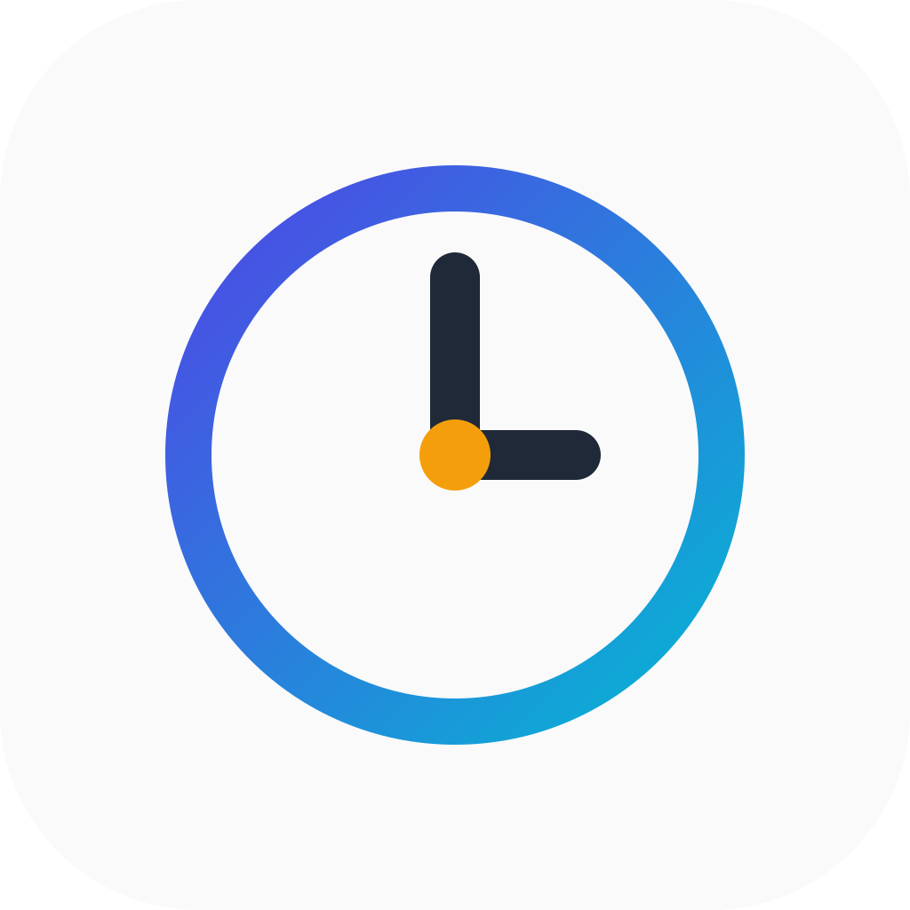

<p align="center">
  
</p>

<h1 align="center">Litechron</h1>

<p align="center">服务于浙大学生的轻量时间管理器</p>

<p align="center">日程一览 · 课表查看 · DDL 助手 · 成绩查询</p>

## 说明

Litechron 基于 [Celechron](https://github.com/Celechron/Celechron) 二次开发，去除了对原项目服务器的依赖，可与官方 Celechron 在同一设备上并存安装。

本项目遵循 [GPLv3](./LICENSE) 协议开源。

## 构建

```
flutter pub get
flutter build apk --release
```

发布版本见 [Releases](https://github.com/bno3bno3/Litechron/releases)。

### Android 稳定版与测试版共存

Android 默认构建稳定版（`production`），`flutter build apk --release` 即可。
构建或调试测试版时，请显式指定 `--flavor development`：

| 变体 | 应用名称 | 应用 ID | 链接协议 |
| --- | --- | --- | --- |
| `production` | Litechron | `io.github.bno3bno3.litechron` | `litechron://` |
| `development` | Litechron 测试 | `io.github.bno3bno3.litechron.dev` | `litechron-dev://` |

连接手机调试测试版：

```powershell
flutter run --flavor development
```

生成可独立安装的测试版：

```powershell
flutter build apk --flavor development --release
```

测试版 APK 位于 `build/app/outputs/flutter-apk/app-development-release.apk`；
稳定版对应 `app-production-release.apk`。测试版与稳定版独立保存本地数据，
测试版需要重新登录；使用相同签名继续安装测试版时，只更新测试版。
正式版沿用原应用 ID 和签名配置。

两个版本登录同一教务账号仍可能互相挤掉远程会话；测试界面功能时建议关闭
测试版的后台刷新及系统日历同步，避免重复登录或写入系统日历。
